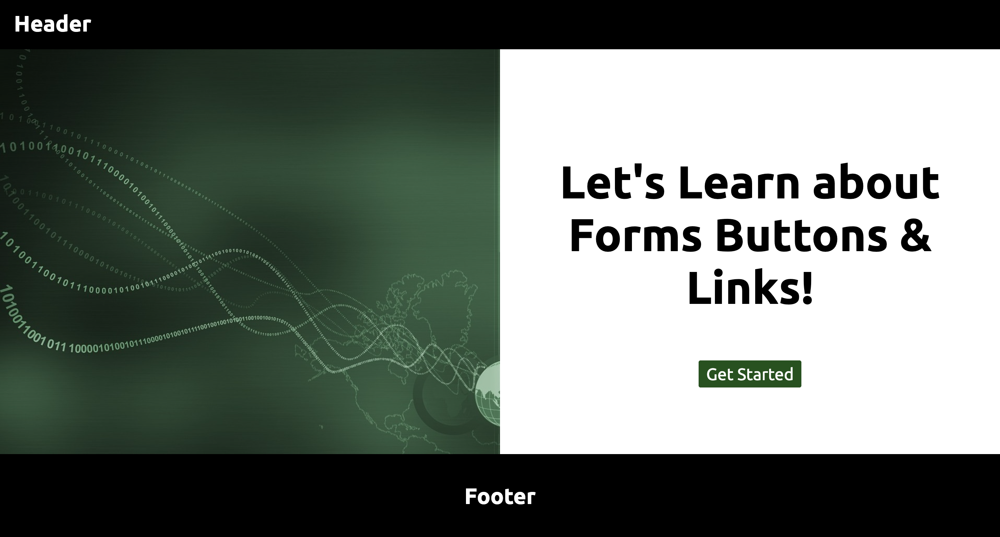
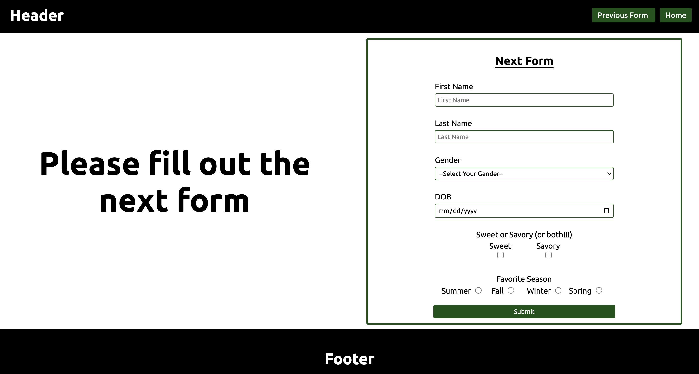

<a name="readme-top"></a>

<!-- PROJECT LOGO -->
<div align="center">
  <a href="">
    
  </a>
<h1 align="center">Forms, Links, & More CSS Styles</h1>
<h4>Learn about building forms and using anchor tags to make websites more interactive and accessible</h4>
</div>

<div align="center">
  <h3>
    <a href="#getting-started" target="_blank" rel="noreferrer noopener">Getting Started</a>
  </h3>
</div>

<!-- SCREENSHOT -->
<h2 align="center">Screenshots</h2>

<div align="center">
  
  
  
  <h2 align="center"></h2>
</div>

## Built With

[](https://html.com/html5/) [](https://www.w3schools.com/css/default.asp)

<!-- GETTING STARTED -->

## Getting Started

You can [download the project](https://github.com/RjayBrown/html-css-forms-and-links/archive/refs/heads/main.zip) or clone and run the project locally to get hands-on practice with the core concepts below. First try changing the width of the input fields (excluding the file upload and color input) to match the width of the submit button. Next, the dropdown menu looks a bit odd, so to improve the visual consistency, you will need to modify the styling to match the other input fields. Also, adding a form reset button will allow the user to easily clear the form. Both buttons should be in the same row. For an extra challenge, you can try styling the file upload button to match the image in the screenshot. There are no hints for this challenge, you may need to use your serching skills and find a working solution!

### Core Concepts

- HTML - Buttons & Anchor Tags
- HTML - Building Forms
- CSS - Accessibility: Input Labels
- CSS - Pseudo-Classes & Transitions

## Build a Mini-Project

Once you complete the challenges you'll be able to use everything you've learned so far to build a Log-In/Sign-Up page that is accessible for all users and looks great! You can create a clone of the login and signup page from your favorite streaming service, place to shop, or restaurant. The starter files are in the project folder. If you run into trouble, you can reach out in the #100Devs [[❓code-help]](https://discord.com/channels/735923219315425401/735925942559440997) channel on Discord. It's an amazing community space filled with supportive developers happy to answer any questions you have!

## Clone & Run Locally

1. Open the terminal in your code editor and type (or copy/paste):

   ```
   git clone https://github.com/RjayBrown/html-css-forms-and-links
   ```

   - _**NOTE:** You can also click the green code button and copy the url (make sure HTTPS is selected)_

2. Navigate to the project folder

   ```
   cd html-css-forms-and-links
   ```

You are now able to access and run the project locally.

<!-- ACKNOWLEDGEMENTS -->

## Acknowledgments

A big thanks to [@100devs](https://github.com/100devs) for the continued support, and [Leon Noel](https://github.com/leonnoel) for the project inspiration.

If you found some value here or just want to support, feel free to give the project a ⭐️!

### More #100Devs Inspired Practice Projects

- [HTML/CSS - Semantic Elements & Basic CSS Styles](https://github.com/RjayBrown/html-css-intro)
- [HTML/CSS - Containers & Responsive Design](https://github.com/RjayBrown/html-css-responsive-design)
- [HTML/CSS - Forms & More CSS Styles](https://github.com/RjayBrown/html-css-forms-and-styles)
- [JavaScript (Client-side) - The DOM(Introduction): User Interaction & Changing the DOM](https://github.com/RjayBrown/javascript-dom-intro)
- [JavaScript (Client-side) - Fetch API(Introduction): Promise Chains & Handling JSON](https://github.com/RjayBrown/javascript-fetch-promise-chains)
- [JavaScript (Client-side) - Fetch API(Advanced): Async/Await & Handling JSON](https://github.com/RjayBrown/war-the-card-game)
- [JavaScript (Client-side) - Fetch API(Advanced): Async/Await & Handling JSON, 2nd Project](https://github.com/RjayBrown/olympics-info)
- [JavaScript (Server-side) - URL Endpoints with NodeJS(Introduction)](https://github.com/RjayBrown/olympics-info)
- [JavaScript (Full-Stack) - MVC Architecture(Introduction)](https://github.com/RjayBrown/hello-world)
- [JavaScript (Full-Stack) - MVC Architecture(Advanced): Authentication](https://github.com/RjayBrown/story-book) - Coming Soon!
- [JavaScript (Full-Stack) - MVC Architecture(Advanced): PostgreSQL](https://github.com/RjayBrown/b-u-b) - Coming Soon!
- [JavaScript (Full-Stack) - MVC Architecture(Advanced): ReactJS](https://github.com/RjayBrown/) - Coming Soon!

<!-- LICENSE -->

## License

This project is distributed under the MIT License. [Click here for more information](LICENSE).

<p align="right">[<a href="#readme-top">back to top</a>]</p>
